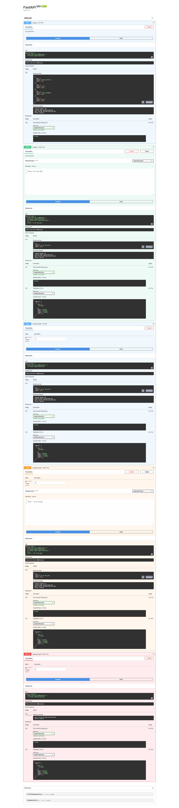

# Task API

A small FastAPI task manager built as a learning project. It keeps tasks in memory, lets you create, read, update, and delete them, and returns JSON responses with proper HTTP status codes.

## Install and run

```bash
uv sync
uv run uvicorn main:app --reload --port 3000
```

Then open:

- API docs: `http://127.0.0.1:3000/docs`
- Root: `http://127.0.0.1:3000/`
- Health: `http://127.0.0.1:3000/health`

## Endpoints

| Method | Path | Description | Success | Errors |
|---|---|---|---|---|
| GET | `/` | API info page | 200 | - |
| GET | `/health` | Health check | 200 | - |
| GET | `/tasks` | Return all tasks | 200 | - |
| GET | `/tasks/{id}` | Return one task by id | 200 | 404 |
| POST | `/tasks` | Create a new task | 201 | 400 |
| PUT | `/tasks/{id}` | Update a task title and/or done flag | 200 | 400, 404 |
| DELETE | `/tasks/{id}` | Delete a task | 204 | 404 |

## Example curl output

```bash
$ curl -i -X POST http://localhost:3000/tasks -H "Content-Type: application/json" -d '{"title":"Vet"}'
HTTP/1.1 201 Created
content-length: 35
content-type: application/json
date: Tue, 28 Jul 2026 19:55:00 GMT
server: uvicorn

{"id":4,"title":"Vet","done":false}
```

## Swagger UI screenshot



## Notes

- Tasks are stored in memory, so data resets when the server restarts.
- `title` must be present and non-empty on create.
- `GET /tasks/{id}` returns `404` if the task does not exist.
- `POST /tasks` assigns the next free id automatically.
- `PUT /tasks/{id}` updates only the fields sent in the request body.
- `DELETE /tasks/{id}` returns `204 No Content` when successful.
